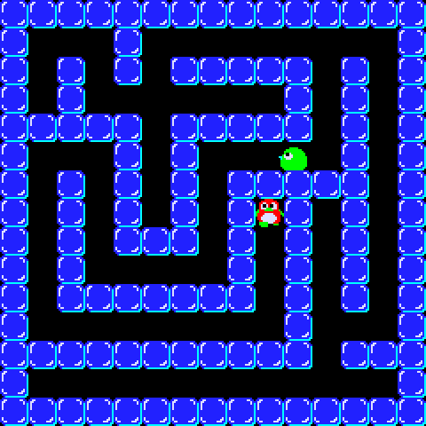

# penguin

Using [pixijs](https://pixijs.download/dev/docs/index.html) to make a retro game



## Try it out

Clone the repo

```sh
git clone https://github.com/borilla/penguin.git
```

Install required modules

```sh
cd penguin
npm intall
```

Start the local HTTP server

```sh
npm start
```

Open the application on localhost: http://127.0.0.1:8080

## Controls

* &lt;Arrow keys&gt; to move
* &lt;Space&gt; to push/crush blocks
* &lt;Escape&gt; to refresh the screen

## Why don't the baddies kill me?

Rome wasn't built in a day

## Thanks

This tutorial was super-useful for getting started with pixijs: https://github.com/kittykatattack/learningPixi
